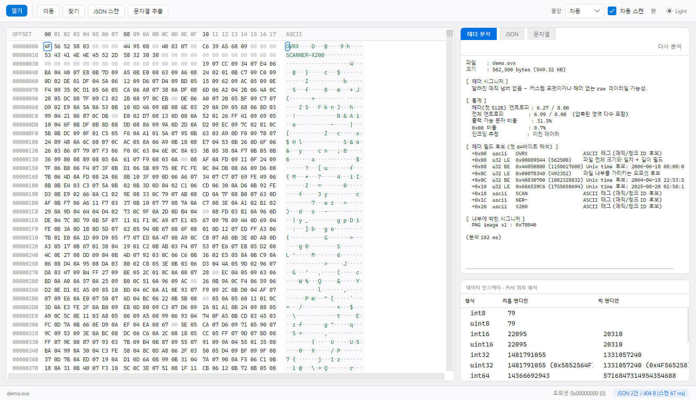
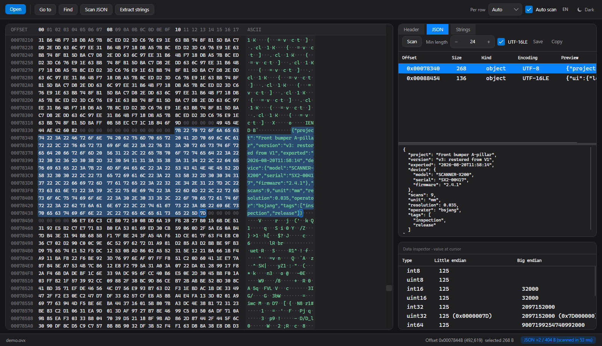
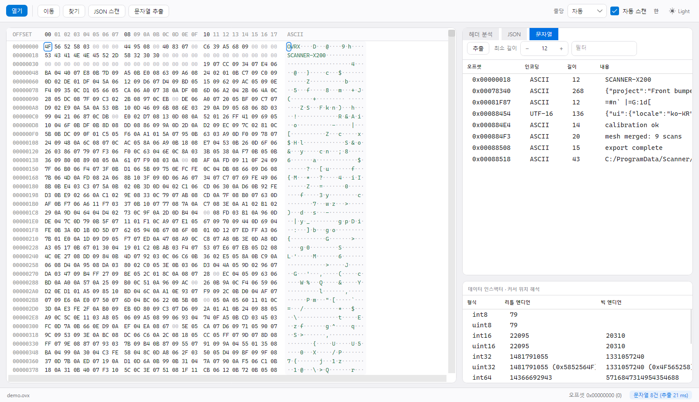

# Binary Viewer

큰 바이너리 파일을 즉시 열어 **헤더에 무엇이 있는지 판단하고**, **파일 안에 박힌 JSON을 찾아내는** 데 초점을
맞춘 뷰어입니다. C# / .NET 9, GUI는 Avalonia 11이라 Windows·macOS·Linux에서 동일하게 동작합니다.
UI와 분석 결과 모두 **한국어 / English** 를 지원합니다.

*A hex viewer focused on identifying file headers and finding JSON embedded in binaries.
Cross platform (Windows / macOS / Linux), Korean and English UI — pass `--lang=en` or use the
language button in the toolbar.*

---

## 화면과 사용 예

아래 화면은 `samples/make-demo.py` 로 만드는 가상의 장비 작업 파일 `demo.ovx`(549 KB)를 연 것입니다.
**확장자도 처음 보고 문서도 없는 파일**을 받았을 때의 상황을 그대로 재현합니다.
(캡처는 Windows에서 앱을 실제로 실행해 렌더링한 것이며, 창 테두리만 빠져 있습니다.)

```bash
python samples/make-demo.py                  # demo.ovx 생성
dotnet run --project Gui -- demo.ovx         # 또는 실행 파일에 드래그 앤 드롭
```

### 1. 열자마자 — 헤더에 뭐가 들어있나



파일을 열면 헤더 분석이 자동으로 돌아 오른쪽 위에 결과가 뜹니다. 이 파일에서는 이렇게 읽힙니다.

| 분석 결과 | 읽는 법 |
|---|---|
| 알려진 매직 넘버 없음 | 표준 포맷이 아님 → 커스텀 포맷 |
| `+0x00 ascii OVRX` | 포맷 고유 태그. 바로 뒤 `+0x04 = 3` 은 버전일 가능성 |
| `+0x08 = 562500` → 파일 크기와 일치 | **전체 길이 필드** |
| `+0x0C = 492352` → 파일 내부를 가리킴 | **오프셋 필드** (실제로 그 자리에 JSON이 있습니다) |
| `+0x10 = 0x68A539C6` | Unix time 범위 → 2025-08-20 02:58:14Z |
| `+0x18 ascii SCANNER-X200` | 장비 모델명 |
| 전체 엔트로피 6.99 / 0x00 비율 0.7% | 대부분이 압축되었거나 조밀한 이진 데이터 |
| `PNG image x1 : 0x78040` | 중간에 썸네일이 박혀 있음 |

문서 없이도 **"태그 + 버전 + 전체 크기 + 오프셋 + 시각 + 장비명"** 이라는 헤더 구조를 몇 초 만에
역추적할 수 있습니다. 헤더 필드 후보는 첫 64바이트를 u32 LE/BE로 전부 훑어 나온 것이라, 값이 우연히
맞아떨어진 줄(`+0x08 u32 BE` 같은)도 함께 보여주고 판단은 사람이 합니다.

왼쪽은 오프셋 + hex + ASCII, 오른쪽 아래는 커서 위치의 바이트를 int8~double·비트·UTF-16·Unix time·
FILETIME으로 동시에 해석하는 데이터 인스펙터입니다. `00` 바이트는 흐리게, 비출력 문자는 `·`로 그려
패딩과 실제 데이터가 한눈에 구분됩니다.

### 2. JSON 탭 — 안에 박힌 정보 블록 꺼내기



파일을 열면 JSON 스캔도 같이 돌아 상태 표시줄에 `JSON ×2 / 404 B` 처럼 요약됩니다.
목록에서 한 줄을 고르면 **hex 뷰가 그 오프셋으로 점프하고 해당 영역이 선택**되며, 아래에 pretty-print
됩니다. 이 파일에서는 헤더의 오프셋 필드가 가리키던 `0x00078340` 에서 장비·버전·내보낸 시각이 담긴
268바이트 JSON이, `0x00088454` 에서는 **UTF-16LE**로 저장된 설정 블록이 나옵니다.
필요한 영역만 `.json`으로 저장하거나 클립보드로 복사할 수 있습니다.

*(이 화면은 언어를 English로, 테마를 다크로 바꾼 상태입니다 — 같은 화면의 다른 모습입니다.)*

### 3. 문자열 탭 — 남아있는 평문 훑기



`strings` 상당의 추출입니다. 최소 길이를 12로 올리면 이진 노이즈가 걷히고 장비 ID, JSON 블록,
꼬리에 붙은 로그(`calibration ok`, `mesh merged: 9 scans`, 경로 문자열)만 남습니다.
ASCII와 UTF-16LE를 함께 찾고, 한 줄을 클릭하면 hex 뷰가 그 오프셋으로 이동합니다.

### 4. 같은 분석을 콘솔에서

GUI 없이도 동일한 결과를 파이프로 뽑을 수 있습니다(SSH·CI 환경).

```console
$ binview demo.ovx --report --json --lang=ko

파일      : demo.ovx
크기      : 562,500 bytes (549.32 KB)

[ 헤더 시그니처 ]
  알려진 매직 넘버 없음 - 커스텀 포맷이거나 헤더 없는 raw 데이터일 가능성.

[ 통계 ]
  헤더(첫 512B) 엔트로피 : 6.27 / 8.00
  전체 엔트로피              : 6.99 / 8.00  (압축된 영역 다수 포함)
  출력 가능 문자 비율        : 31.5%
  0x00 비율                  : 0.7%
  인코딩 추정                : 이진 데이터

[ 헤더 필드 후보 (첫 64바이트 해석) ]
  +0x00  ascii   OVRX                   ASCII 태그 (매직/청크 ID 후보)
  +0x08  u32 LE  0x00089544 (562500)    파일 전체 크기와 일치 -> 길이 필드
  +0x08  u32 BE  0x44950800 (1150617600) Unix time 후보: 2006-06-18 08:00:00Z
  +0x0C  u32 LE  0x00078340 (492352)    파일 내부를 가리키는 오프셋 후보
  +0x0C  u32 BE  0x40830700 (1082328832) Unix time 후보: 2004-04-18 22:53:52Z
  +0x10  u32 LE  0x68A539C6 (1755658694) Unix time 후보: 2025-08-20 02:58:14Z
  +0x18  ascii   SCAN                   ASCII 태그 (매직/청크 ID 후보)
  +0x1C  ascii   NER-                   ASCII 태그 (매직/청크 ID 후보)
  +0x20  ascii   X200                   ASCII 태그 (매직/청크 ID 후보)

[ 내부에 박힌 시그니처 ]
  PNG image x1 : 0x78040

(열기 1.0 ms, 분석 포함 41.4 ms)
[ 처음 256 바이트 ]
00000000  4F 56 52 58 03 00 00 00  44 95 08 00 40 83 07 00  OVRX....D...@...
00000010  C6 39 A5 68 09 00 00 00  53 43 41 4E 4E 45 52 2D  .9.h....SCANNER-
00000020  58 32 30 30 00 00 00 00  00 00 00 00 00 00 00 00  X200............
  ... (기본 256바이트)

[ JSON 영역 2건, 스캔 11.0 ms ]
  0x00078340         268 B  object UTF-8    depth 3   {"project":"Front bumper A-pillar","version":"v3: restored from V1", ...
  0x00088454         136 B  object UTF-16LE depth 3   {"ui":{"locale":"ko-KR","theme":"dark"},"lastOpened":"D:/jobs/0820"}
```

`--lang=en` 을 주면 같은 리포트가 영어로 나옵니다.

### 테마와 언어

macOS 감성(그룹 배경 위의 카드, 헤어라인 구분선, 시스템 블루, 세그먼티드 탭)을 따르며 **시스템 라이트/다크를
자동으로 따라갑니다.** 툴바 오른쪽 버튼으로 직접 전환할 수 있고, 버튼은 **현재 상태**(☀ Light / ☾ Dark)를
표시합니다. 언어 버튼(한 / EN)도 현재 언어를 표시합니다. 위 1·3번과 2번 화면이 각각 한국어 라이트,
English 다크입니다.

선택한 언어·테마는 `%APPDATA%/BinaryViewer/settings.json`(macOS·Linux는 대응 경로)에 저장되어 다음 실행에
복원됩니다. 저장된 값이 없으면 시스템 UI 언어를 따르며, `--lang=ko|en` 으로 강제할 수 있습니다.

## 프로젝트 구성

| 프로젝트 | 출력 | 플랫폼 |
|---|---|---|
| `Core/BinaryViewer.Core.csproj` | 분석 엔진 (net9.0 라이브러리) | Windows / Linux / macOS |
| `Gui/BinaryViewer.Gui.csproj` | `BinaryViewer` (Avalonia GUI) | Windows / Linux / macOS |
| `Cli/BinaryViewer.Cli.csproj` | `binview` (콘솔) | Windows / Linux / macOS |
| `BinaryViewer.csproj` | WinForms GUI (첫 구현, 레거시) | Windows 전용 |

분석 엔진은 OS 의존 API를 쓰지 않습니다. WinForms 판은 초기 구현을 남겨둔 것이며 기능은 Avalonia 판과 같습니다.

## 빌드 / 실행

```bash
dotnet build -c Release

# GUI (권장)
Gui\bin\Release\net9.0\BinaryViewer.exe [파일]
dotnet run --project Gui -- [파일]

# 콘솔
dotnet run --project Cli -- <파일> --report --json
```

Visual Studio는 `BinaryViewer.sln`을 열면 됩니다.

### 맥북 / 리눅스 배포

`--self-contained true` 면 대상 머신에 .NET 설치가 필요 없습니다.

```bash
# macOS (Apple Silicon) - .app 번들 + 드래그앤드롭 설치용 DMG
./scripts/make-macos-app.sh osx-arm64 --dmg    # 인텔 맥은 osx-x64

# 실행 파일만
dotnet publish Gui -c Release -r osx-arm64 --self-contained true -o out/mac
dotnet publish Gui -c Release -r linux-x64 --self-contained true -o out/linux
dotnet publish Cli -c Release -r linux-arm64 --self-contained true -o out/cli
```

리눅스 GUI는 X11 또는 Wayland가 필요합니다(헤드리스 서버라면 `binview` 사용). Skia·HarfBuzz 네이티브
라이브러리는 publish 폴더에 함께 들어갑니다.

맥에서는 만들어진 `BinaryViewer.app` 을 **Applications 폴더로 드래그하면 설치 끝**입니다(런타임 설치 불필요).
`--dmg` 를 주면 Applications 심볼릭 링크가 들어간 디스크 이미지까지 만들어져, 흔히 보는 그 설치 창이 나옵니다.
다만 Apple Developer ID 서명·공증은 되어 있지 않아 인터넷으로 받은 사본은 첫 실행 때 Gatekeeper가 막을 수
있습니다 — 우클릭 > 열기, 또는 `xattr -dr com.apple.quarantine` 로 해제하면 됩니다.

## 기능

### 헤더 분석
- 50여 종 매직 넘버 판별(PNG/ZIP/PE/ELF/SQLite/PCAP/OLE2/MP4 …). 고정 오프셋 시그니처 포함(TAR `ustar`@257 등).
- 헤더·전체 엔트로피, 출력 가능 문자 비율, `0x00` 비율, 인코딩(BOM·UTF-16 패턴) 추정.
- **헤더 필드 후보 자동 추론**: 첫 64바이트를 u32 LE/BE로 훑어 파일 크기와 일치하는 길이 필드,
  파일 내부를 가리키는 오프셋, Unix time 범위 값, 4바이트 ASCII 태그를 표시합니다.
  알려지지 않은 커스텀 포맷의 헤더 구조를 역추적할 때 쓰는 부분입니다.
- 파일 내부에 박힌 시그니처 카빙(중간에 들어있는 PNG·ZIP의 오프셋 목록).
- **ZIP 컨테이너 분석**: ZIP/ZIP64면 중앙 디렉터리를 직접 읽어 엔트리 목록(이름·크기·압축방식·시각)과
  암호화 방식(ZipCrypto / WinZip AES-128·192·256, AE-1/AE-2, 실제 압축방식)을 보여줍니다.
  전부 암호화된 아카이브는 "메타데이터만 평문이고 내용은 볼 수 없음"을 명시합니다.

### JSON
- 파일 전체를 1-패스로 훑으며 `{` / `[` 마다 **엄격한 JSON 문법 검증**을 시도합니다.
  실패하면 몇 바이트 만에 중단되므로 이진 노이즈에서도 빠릅니다.
- UTF-8·UTF-16LE 모두 탐지. 잘린 JSON, `{'c':1}`, `{"a":01}`, 후행 쉼표 등은 걸러냅니다.
- 오프셋 / 길이 / object·array / 인코딩 / 미리보기로 나열되고, 선택하면 hex에서 해당 영역이
  강조·선택되며 아래에 pretty-print 됩니다. 그 영역만 `.json`으로 저장 가능.
- 파일을 열면 자동 스캔합니다(툴바에서 해제 가능).

### 문자열
ASCII / UTF-16LE 문자열 추출(`strings` 상당), 최소 길이·필터 조절, 클릭하면 해당 오프셋으로 이동.

### 그 밖에
- 찾기(Ctrl/⌘+F): 텍스트(UTF-8·UTF-16LE, 대소문자 무시) 또는 hex 패턴(`50 4B 03 04`), F3 / Shift+F3.
- 이동(Ctrl/⌘+G), 전체 선택(Ctrl/⌘+A), 선택 영역 hex 복사(Ctrl/⌘+C), Esc로 스캔 중지.
- 드래그 앤 드롭으로 파일 열기. 줄당 바이트 수 자동/8~64 (넘치면 가로 스크롤).
- 128MB 이하는 전량 메모리 적재, 초과 시 32MB 슬라이딩 윈도우 메모리 맵으로 자동 전환.

## 콘솔 모드 옵션

[위 4번](#4-같은-분석을-콘솔에서)의 출력 예시 참고. GUI 실행 파일도 같은 옵션을 받습니다.

```bash
binview file.bin --report            # 헤더·통계·필드 후보·ZIP 구조 + 앞 256바이트 덤프
binview file.bin --json              # JSON 영역 목록
binview file.bin -s --min=10         # 문자열만, 최소 10자
binview file.bin --report --json --lang=en
```

## 실측 (참고용, 이 PC 기준)

| 파일 | 열기 | 헤더 분석 | JSON 스캔 |
|---|---|---|---|
| 10 MB 혼합 바이너리 | 12 ms | 82 ms | 72 ms |
| 2.3 MB 순수 JSON | - | - | 69 ms |
| 10 MB 전부 `{` (최악 케이스) | - | - | 386 ms |
| 200 MB (메모리 맵) | 즉시 | ~1 s | 1.4 s |

## 소스 구조

| 파일 | 역할 |
|---|---|
| `Core/ByteSource.cs` | 메모리 / 메모리맵 바이트 소스, 버퍼 리더 |
| `Core/Signatures.cs` | 매직 넘버 테이블 |
| `Core/FileAnalyzer.cs` | 헤더 판별, 엔트로피, 필드 추론, 시그니처 카빙 |
| `Core/ZipInspector.cs` | ZIP/ZIP64 중앙 디렉터리 파싱, 암호화 방식 판별 |
| `Core/JsonScanner.cs` | JSON 영역 탐지 + 엄격 파서 |
| `Core/StringScanner.cs` | ASCII/UTF-16 문자열 추출 |
| `Core/ByteSearcher.cs` | Boyer-Moore-Horspool 검색 |
| `Core/Strings.cs` | 한국어 / English 문자열 테이블 |
| `Core/TextReport.cs` | 콘솔 출력 (GUI·CLI 공용) |
| `Gui/HexView.cs` | 가상화 hex/ASCII 렌더링 컨트롤 (Avalonia DrawingContext) |
| `Gui/MainWindow.axaml(.cs)` | 창 구성, 백그라운드 스캔, 데이터 인스펙터 |
| `Gui/Styles/AppleStyles.axaml` | 라이트/다크 테마 토큰과 컨트롤 스타일 |
| `Gui/Stepper.cs` | 좌 − / 값 / 우 + 형태의 숫자 입력 컨트롤 |
| `Gui/Settings.cs` | 언어·테마 기억 |
| `Gui/Dialogs.cs` | 이동 / 찾기 / 메시지 대화상자 |
| `Cli/Program.cs` | 크로스 플랫폼 CLI 진입점 |
| `UI/*.cs` | WinForms 판 (Windows 전용 레거시) |
| `samples/make-demo.py` | 위 사용 예에 쓰인 `demo.ovx` 생성기 |
| `docs/*.png` | README 화면 캡처 |

## 알려진 제한

- macOS·Linux에서의 **실제 실행은 검증하지 못했습니다.** 크로스 컴파일과 네이티브 의존성 포함까지만 확인했습니다.
- 암호화된 아카이브의 내용은 복호화하지 않습니다(메타데이터만 표시).
- WinForms 판은 다국어·새 디자인이 적용되지 않은 초기 버전입니다.
